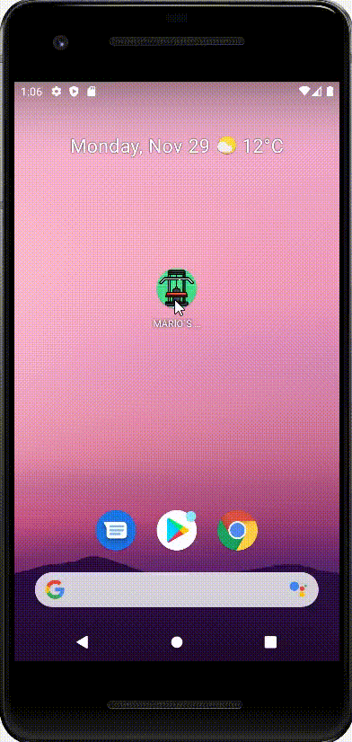

# ----------- **FIRST** -----------

## DESAROLLO DE INTERFACES - MARIO MUÑOZ FUENTES

## 1. **INTRODUCCIÓN:**
Para comenzar este proyecto guiado, en primer lugar hicimos un boceto utilizando el programa *Adobe XD*.
Esto nos sirvió para comenzar a iniciarnos con el mundo del desarrollo de apps y poder partir desde ahi.

## 2. **PENSAR LA TEMÁTICA:**
Pensé que una buena temática podía ser una aplicación de gymnasio, ya que es un tema que me gusta, y podía tener

## 2. *CREACIÓN DEL PROYECTO:* CURSIVA

## 3. **:**

## 4. **:**

## 5. **:**

