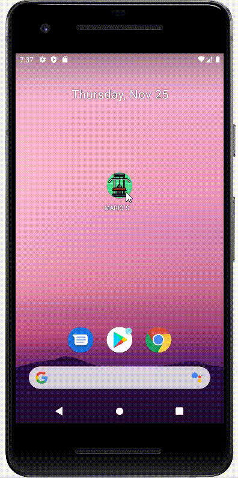

# ----------- **FIRST** -----------

## DESAROLLO DE INTERFACES - MARIO MUÑOZ FUENTES
## 1. **PENSAR LA TEMÁTICA:**

En primer lugar, lo primero que hice fue pensar sobre que quería hacer mi app.
Decidí que iba a ser sobre un gimnasio, ya que tambien habia hecho la pagina web sobre el mismo tema.

## 2. **CREACIÓN DEL PROYECTO:**

## 3. **PENSAR LA TEMÁTICA:**

## 4. **PENSAR LA TEMÁTICA:**

## 5. **PENSAR LA TEMÁTICA:**

