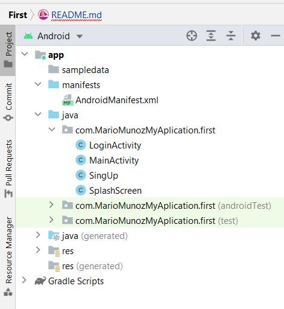

# ----------- **FIRST** -----------

## DESAROLLO DE INTERFACES - MARIO MUÑOZ FUENTES

## 1. **INTRODUCCIÓN:**
Para comenzar este proyecto guiado, en primer lugar hicimos un boceto utilizando el programa *Adobe XD*.
Esto nos sirvió para comenzar a iniciarnos con el mundo del desarrollo de apps y poder partir desde ahi.

## 2. **PENSAR LA TEMÁTICA:**
Pensé que una buena temática podía ser una aplicación de gymnasio, ya que es un tema que me gusta, y podría desarrollarlo bien.

## 3. **CREACIÓN DEL PROYECTO:**
Para empezar elegimos una actividad en blanco la cual fuimos desarrollando y creando las distintas ventanas en ella.

## 4. **DESARROLLO DEL PROYECTO:**

#### 4.1. MANIFEST:
En el archivo ***"AndroidManifest.xml"*** es en el cual por ejemplo, podemos declarar cual va a ser la ventana en la que va a iniciar la aplicación, o cambiar el nombre de la app...

#### 4.2. JAVA:

######   4.2.1 LoginActivity
Aquí hemos puesto el fondo de la ventana principal *(activity_login.xml)* y también hemos puesto los enlaces de los botones.
El botón de ***"Entrar"*** al ***"MainActivity"***  y el botón de ***"Registrarse"*** nos lleva al ***"SingUp"*** .

######   4.2.1 MainActivity
Esta parte es la que más código lleva, ya que es la parte principal de la aplicación.
Aquí hemos incluido un ***"refresh"*** que cada vez que refrescamos nos muestra una imagen de una página web que crea caras de *personas que no existen* y aparece un mensaje en la parte inferior de la pantalla que dice *"Hi there!! I don`t exixt:)"*
En la parte del Status Bar hemos incluido dos iconos, uno de una lupa y otro de una tuerca, y a continuación incluimos las opciones de *"About Us"* y *"Sing Out"* los cuales estan ocultos hasta que pinchamos en los 3 puntitos.

Si pinchamos en la opción de ***"SingUp"*** nos aparece un diálogo de alerta en el cual si pinchamos en *"Other"* nos vuelve a la página en la que estábamos, en cambio si pinchamos en *"SingUp"* accedemos a la ventana *"SingUp"*.

######   4.2.1 SingUp

######   4.2.1 SplashScreen

#### 4.3. MANIFEST:

#### 4.4. MANIFEST:

#### 4.. MANIFEST:

## 5. **:**

## 6. **:**

